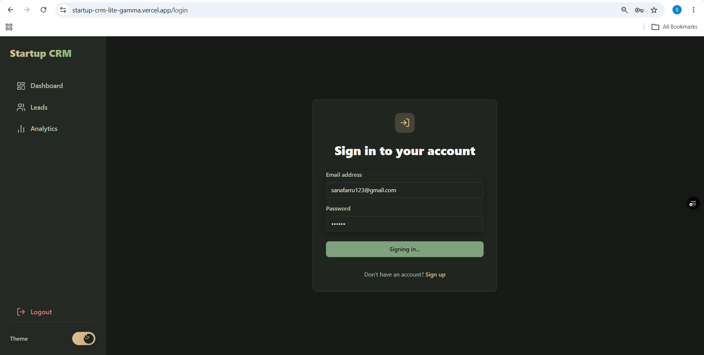
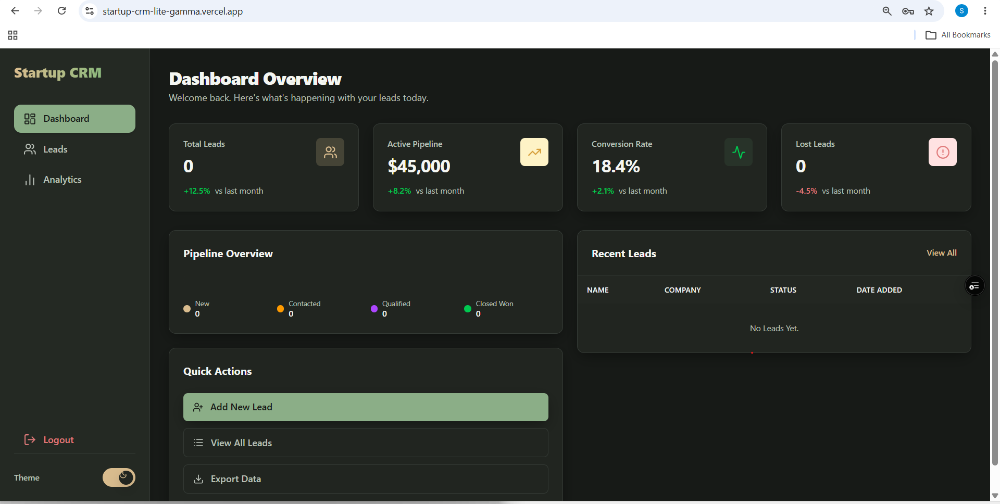
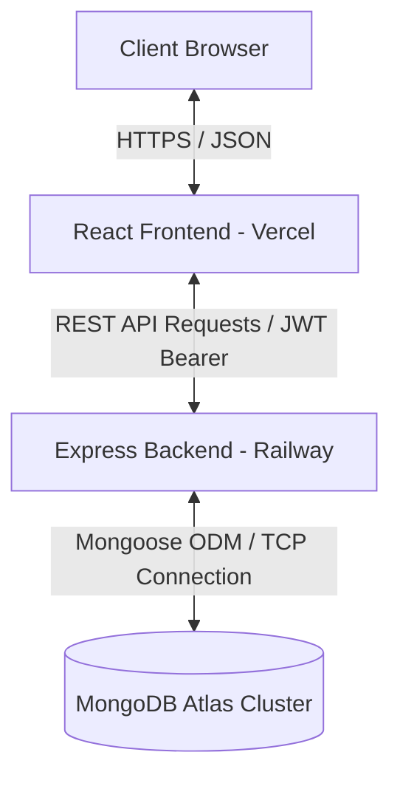
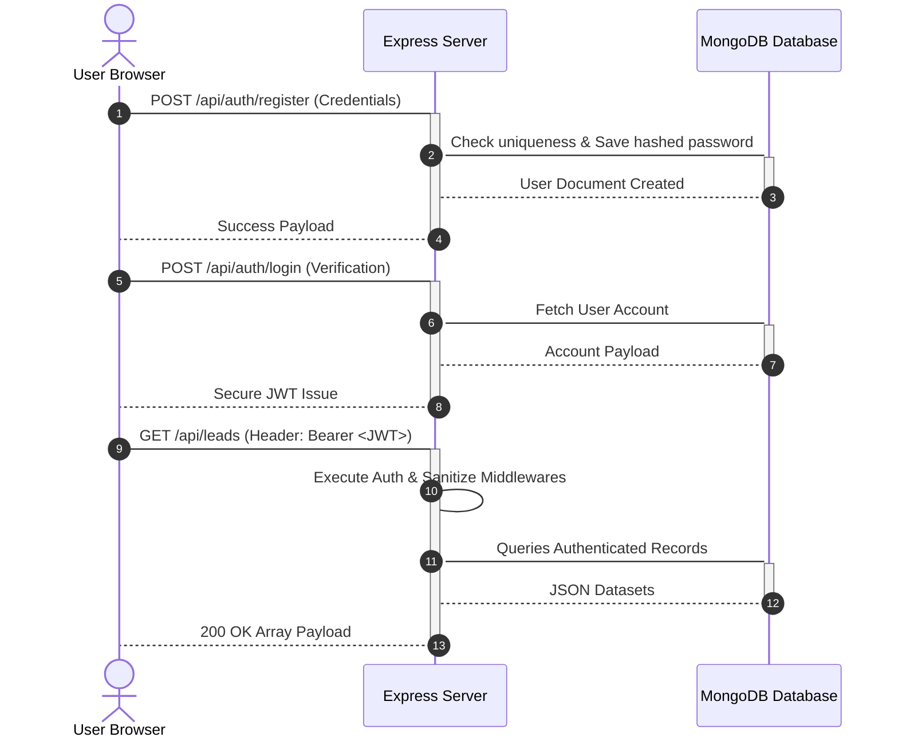

```markdown
# Startup CRM Lite

<p align="center">
  <!-- Technology Badges -->
  
  
  
  
  
  
  <!-- Deployment Badges -->
  
  
</p>

---

## Table of Contents

1. [Project Overview](#project-overview)
2. [Problem Statement](#problem-statement)
3. [Vision & Objectives](#vision--objectives)
4. [Key Features](#key-features)
5. [Target Users & Use Cases](#target-users-and-use-cases)
6. [Business Value](#business-value)
7. [Live Demo](#live-demo)
8. [Screenshots](#screenshots)
9. [System Architecture](#system-architecture)
10. [Technology Stack](#technology-stack)
11. [Project Folder Structure](#project-folder-structure)
12. [Module & File Explanation](#module-and-file-explanation)
13. [Component Architecture](#component-architecture)
14. [API Specification Overview](#api-specification-overview)
15. [Authentication & Authorization](#authentication--authorization)
16. [Security & Optimization Strategies](#security--optimization-strategies)
17. [Development Prerequisites](#development-prerequisites)
18. [Installation & Local Configuration](#installation--local-configuration)
19. [Running the Application](#running-the-project)
20. [Testing & Quality Assurance](#testing-strategy)
21. [Deployment & CI/CD](#deployment-guide)
22. [Limitations & Future Roadmap](#limitations--future-roadmap)
23. [Troubleshooting & FAQ](#troubleshooting--faq)
24. [License](#license)
25. [Contact](#contact)

---

## Project Overview
**Startup CRM Lite** is a sleek, lightweight, production-grade Customer Relationship Management (CRM) platform engineered specifically for lean startups and agile teams. Built upon the powerful **MERN (MongoDB, Express, React, Node.js)** ecosystem and bundled using **Vite**, the system provides a high-performance interface for sales tracking, pipeline transparency, and contact lifecycle management without the overhead of enterprise bloatware.

## Problem Statement
Early-stage startups and small businesses often find themselves trapped between two suboptimal choices for sales pipelines:
*   Overly manual, unscalable, and error-prone tracking mechanisms like spreadsheets.
*   Heavyweight enterprise CRMs that present steep learning curves, excessive administrative overhead, and premium cost structures.

This gap results in lost leads, uncoordinated team communication, and an absence of actionable real-time analytics.

## Vision & Objectives
The platform offers an accessible alternative that requires minimal configuration yet guarantees absolute architectural robustness. 
*   **Simplicity First:** Eliminate distractions to focus solely on high-value interactions.
*   **Security by Default:** Guard proprietary business intelligence and user records with modern cryptographic standards.
*   **Cloud-Native & Scalable:** Ensure seamless decoupling between the interactive client state and resilient database clusters.

---

## Key Features
*   **Secure Authentication:** User signup and sign-in verified through JSON Web Tokens (JWT) stored safely with stateless validation.
*   **Pipeline & Lead Management:** Comprehensive CRUD operations to track dynamic contact status, values, and engagement paths.
*   **Data Validation & Sanitization:** Multi-layered defense barriers preventing invalid tracking parameters or database injection attacks.
*   **Aggregated Analytics:** Back-end utility layers processing metrics into analytical readouts.
*   **Rate-Limiting Protection:** Safeguarded back-end infrastructure preventing brute-force authentication attempts or service denials.

---

## Target Users and Use Cases
*   **Founders & Solo Entrepreneurs:** Quickly log potential customer conversations during initial discovery and funding rounds.
*   **Sales Representatives:** Move prospective customers smoothly down structured funnel columns from cold discovery to closed contracts.
*   **Account Managers:** Store structural details for active company accounts securely in one place.

---

## Business Value
*   **Accelerated Velocity:** Reduces sales onboarding time to minutes.
*   **Zero-Cost Infrastructure Alignment:** Optimized to run cost-effectively on dynamic cloud providers (Vercel + Railway) inside lightweight computing boundaries.
*   **Data Integrity:** Minimizes administrative oversight via systematic back-end model structural enforcement.

---

## Live Demo

Frontend:
https://startup-crm-lite-gamma.vercel.app

Backend:
https://startup-crm-lite-production.up.railway.app

---

## Screenshots

### Login Page



### Dashboard



### Lead Management

Coming Soon

### Analytics

Coming Soon

---

## System Architecture

The application adopts a classic decoupled client-server blueprint ensuring complete isolation between presentation and core business layers.

### High-Level Architecture Flow


### Application Workflow Diagram



---

## Technology Stack

### Frontend Core

* **Framework:** React 18+ (Functional Components & Hooks Architecture)
* **Build Tool & Dev Server:** Vite (Optimized HMR and code-splitting modules)
* **State Management & Routing:** Native React state management and unified asynchronous Axios configurations.

### Backend Core

* **Runtime Environment:** Node.js
* **Web Framework:** Express.js (Asynchronous routing configuration)
* **Database Access Layer:** Mongoose Object Data Modeling (ODM)

### Storage Tier

* **Database:** MongoDB Atlas (Document-based JSON store natively optimized for horizontally dynamic read/write access patterns)

### Hosting & Deployment Platforms

* **Frontend Distribution:** Vercel Global Edge Network
* **Backend Application Containerization:** Railway Cloud Infrastructure Engine

---

## Project Folder Structure

```text
startup-crm-lite/
├── backend/
│   ├── config/
│   │   └── database.js
│   ├── controllers/
│   │   ├── authController.js
│   │   └── leadController.js
│   ├── middleware/
│   │   ├── auth.js
│   │   ├── errorHandler.js
│   │   └── validate.js
│   ├── models/
│   │   ├── Lead.js
│   │   └── User.js
│   ├── routes/
│   │   ├── authRoutes.js
│   │   └── leadRoutes.js
│   ├── utils/
│   ├── .env
│   ├── .gitignore
│   ├── package.json
│   ├── package-lock.json
│   └── server.js
│
├── public/
│
├── src/
│   ├── context/
│   │   └── ThemeContext.jsx
│   ├── data/
│   ├── hooks/
│   ├── pages/
│   ├── routes/
│   │   └── index.jsx
│   ├── services/
│   │   ├── api.js
│   │   ├── authService.js
│   │   └── leadService.js
│   ├── utils/
│   ├── App.jsx
│   ├── index.css
│   └── main.jsx
│
├── dist/
├── node_modules/
├── .env
├── .env.production
├── .gitignore
├── add-dark.cjs
├── clean-duplicates.cjs
├── eslint.config.js
├── index.html
├── package.json
├── package-lock.json
├── README.md
├── test-api.js
├── vercel.json
└── vite.config.js
```

## Module and File Explanation

### Backend Subsystem

#### Core Entry & Configuration

* `backend/server.js`: The foundation of the web server. Instantiates Express, configures global CORS constraints, registers critical security layers, binds system routes, and sets up centralized error trapping hooks.
* `backend/config/database.js`: Abstracts out network-wide connection management toward remote MongoDB clusters using optimized pooling layers via Mongoose.

#### Domain Schemas (Models)

* `backend/models/User.js`: Defines the identity structural representation format. Enforces distinct username and email index criteria. Employs cryptographically secured pre-save hooks utilizing `bcryptjs` algorithms to automatically map plaintext credentials into high-entropy hashes.
* `backend/models/Lead.js`: Maps out business development operational tracking structures. Explicitly maps target record parameters such as Name, Email, Corporate Domain, Sales Valuation metrics, current status milestones (`New`, `Contacted`, `In Progress`, `Won`, `Lost`), and binds ownership identities back to a target single tenant `User` entity.

#### Route Execution Layers (Controllers)

* `backend/controllers/authController.js`: Manages standard secure authorization lifecycle logic. Validates inputs, handles identity matching workflows, and signs authorization payloads using private system encryption keys.
* `backend/controllers/leadController.js`: Encapsulates high-performance localized multi-tenant isolation query commands ensuring individuals can only inspect, manipulate, or prune operational tracking datasets bound directly to their active session entity identifier.

---

## Component Architecture

### Security Context Interceptors (Middleware)

* `backend/middleware/auth.js`: Safeguards private path infrastructure. Intercepts incoming web envelopes, evaluates associated cryptographic signature states via `jsonwebtoken`, extracts embedded tenant identification tracking parameters, and securely updates contextual routing variables.
* `backend/middleware/validate.js`: Operates as an engineering sanity guard. Intercepts parameters passing through registration boundaries before down-stream compute nodes expend resources on handling un-vetted parameters.
* `backend/middleware/errorHandler.js`: Provides an elegant catch-all abstraction wrapper avoiding execution traceback leakages toward client terminals while ensuring accurate structural error response codes are maintained across edge connections.

---

## API Specification Overview

All operational traffic utilizes structural JSON transaction formatting containing a strict `Bearer <Token>` payload passing along authorization segments.

### Authentication Endpoints

| HTTP Verb | Path | Context Purpose | Access Control |
| --- | --- | --- | --- |
| `POST` | `/api/auth/register` | Identity Account Creation Block | Public |
| `POST` | `/api/auth/login` | Signature Authentication Lifecycle | Public |

### Lead Lifecycle Pipelines

| HTTP Verb | Path | Context Purpose | Access Control |
| --- | --- | --- | --- |
| `GET` | `/api/leads` | Queries Authenticated Records | Authenticated |
| `POST` | `/api/leads` | Appends New Operational Records | Authenticated |
| `PUT` | `/api/leads/:id` | Modifies Specific Record Fields | Authenticated |
| `DELETE` | `/api/leads/:id` | Purges Target Identity Record | Authenticated |

---

## Authentication & Authorization

The system relies entirely on a **Stateless Token Validation Model**:

1. Upon submission of legitimate verification details to the authentication node, the system returns a cryptographically signed signature object containing identity reference elements.
2. The interactive client app caches the signature within browser runtime structures and appends it to subsequent request envelopes under the `Authorization: Bearer <Token>` header format.
3. The server decomposes the tracking token payload inside structural validation filters to guarantee continuous access control execution security boundaries.

---

## Security & Optimization Strategies

### Runtime Security Enforcement

* **Helmet Integration:** Automatically sets secure HTTP headers to mitigate cross-site scripting (XSS) risks and prevent clickjacking.
* **Database Injection Prevention:** Utilizes `express-mongo-sanitize` to intercept recursive lookups and scrub raw request keys of query operators like `$` and `.`.
* **API Rate-Limiting Controls:** Restricts client IP addresses via `express-rate-limit` to prevent brute-force credential attacks or resource degradation across core authentication pathways.
* **CORS Hardening:** Restricts cross-origin resource sharing to trusted, explicitly whitelisted source origins.

### Data Validation and Integrity

* **Mongoose Validation Layer:** Server schemas reject data mutations that fail email syntax checks, string boundaries, or status enumerations before they hit the database layer.

---

## Development Prerequisites

Before beginning local initialization routines, ensure the following runtime frameworks are accessible within the local development space:

* **Node.js LTS Platform:** Engine Version `18.x` or higher recommended.
* **Package Management Engine:** `npm` (typically shipped with Node) or `yarn`.
* **Database Tier:** A local instance of MongoDB Server or an active MongoDB Atlas cluster cloud access configuration string.

---

## Installation & Local Configuration

### 1. Repository Setup

```bash
git clone https://github.com/shaiksanafarheen14-afk/startup-crm-lite.git
cd startup-crm-lite

```

### 2. Back-End Server Dependency Configuration

```bash
cd backend
npm install

```

### 3. Front-End Interface Client Dependency Configuration

```bash
npm install

```

---

## Environment Configuration

The project uses separate environment files for the frontend and backend.

### Frontend Development (`startup-crm-lite/.env`)

```env
VITE_API_URL=http://localhost:5000
```

Used when running the frontend locally with `npm run dev`.

---

### Frontend Production (`startup-crm-lite/.env.production`)

```env
VITE_API_URL=https://startup-crm-lite-production.up.railway.app
```

Used when deploying the frontend to Vercel.

---

### Backend (`backend/.env`)

```env
PORT=5000
MONGODB_URI=mongodb+srv://<username>:<password>@cluster.mongodb.net/crm_lite?retryWrites=true&w=majority
JWT_SECRET=YOUR_HIGH_ENTROPY_SUPER_SECURE_JWT_SIGNING_PASSPHRASE
JWT_EXPIRES_IN=7d
NODE_ENV=development
FRONTEND_URL=http://localhost:5173
```

---

## Running the Project

### Local Development Environment Execution

#### Instantiating the API Microservices Layer

```bash
cd backend
npm run dev

```

> The web back-end service defaults to listening at network gateway context addresses mapping toward: `http://localhost:5000`

#### Instantiating the Client-Side User Interface

```bash
npm run dev

```

> The asset compilation framework exposes an interactive interface reachable locally via: `http://localhost:5173`

---

## Testing Strategy

The application uses a segmented diagnostic framework pattern to verify system stability:

* **Validation Checkpoints:** Endpoints are validated under strict parameter boundary scripts before merging branch updates into main pipelines.
* **Multi-Tenant Validation:** Isolation test loops ensure that logged-in tenants cannot inspect or mutate adjacent sibling tenant records.

---

## Deployment Guide

The architecture separates the frontend build from backend compute resources for optimized edge delivery.

### Front-End Production Pipeline (Vercel Integration)

1. Link your source control repository workspace directly into your Vercel administrative team profile interface dashboard panel.
2. Inject critical routing destination parameters matching production endpoint contexts: `VITE_API_URL=https://startup-crm-lite-production.up.railway.app`.
3. Vercel automatically processes and deploys client builds into low-latency edge-caching node arrays.

### Back-End Service Infrastructure Containerization (Railway Integration)

1. Create an active standalone deployment slot map associated directly with the target tracking branch layout configuration properties inside Railway.
2. Map production environment configuration variables inside the variable storage block configuration properties matching database access arrays (`MONGODB_URI`, `JWT_SECRET`, `NODE_ENV=production`).
3. The platform reads the local build declaration parameters via structural `package.json` definitions, compiles the execution images, and exposes a secure production-grade link connection gateway.

---

## Limitations & Future Roadmap

* **Current Constraints:** The software uses stateless user record stores. Lead history rollbacks or detailed interaction change logs are not supported yet.
* **Scheduled Feature Implementations:**
* Dynamic CSV record transaction injection and retrieval migration support matrices.
* Automated analytical charting engines reporting performance trend vectors across pipeline columns.
* Role-Based Access Control (RBAC) enabling tiered permission states within multi-user startup teams.


---

## Troubleshooting & FAQ

### **Q: Why are database updates failing with a validation error code?**

**A:** Ensure all data inputs align with the schema validation metrics enforced in `backend/models/Lead.js`. For instance, lead statuses must exactly match one of the predefined values: `New`, `Contacted`, `Meeting Scheduled`, `Won`, or `Lost`.

### **Q: Why does the authentication token keep getting rejected across routing checks?**

**A:** Ensure the `Authorization` header follows the explicit `Bearer <Token>` format. Additionally, verify that the `JWT_SECRET` key configured in your runtime variables perfectly matches the parameters assigned during back-end initialization routines.

---

## License

This project is licensed under the MIT License.

---

## Contact 
**Developer:** Shaik Sana Farheen

**GitHub**
https://github.com/shaiksanafarheen14-afk/startup-crm-lite

**LinkedIn**
https://www.linkedin.com/in/sana-farheen-shaik/

**Email**
shaiksanafarheen14@gmail.com
```

```